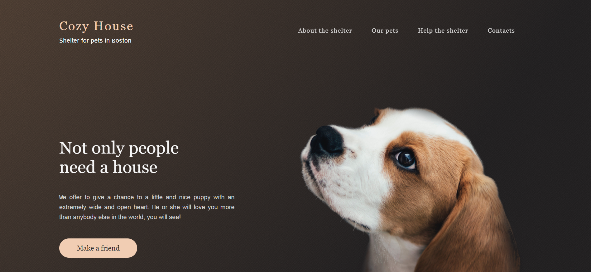

# Pets-shelter

***This multi-page site is designed according to the layout in Figma. 
This is one of my projects that I developed while I was studying at the course of frontend development in School.
There is a responsive design for resolutions 1600, 1400, 1280, 785, 375 px.
The data is used for sliders is a JSON file. Each slider page is generated randomly from 8 initial data.***

## technology stack
+ HTML
+ CSS
+ JavaScript
+ Gulp
 
[deploy](https://pets-shelter.netlify.app/)
